# Kavia AI — Documentation Structure

## File Tree

```
docs/
├── getting-started/
│   ├── overview.md
│   ├── quickstart.md
│   └── release-notes.md
├── enterprise/
│   ├── model.md
│   ├── secure-deployment.md
│   └── security.md
├── advanced-concepts/
│   ├── mcp.md
│   ├── skills.md
│   ├── kavia-subagents.md
│   └── dynamic-prompting.md
└── faqs-and-troubleshooting.md
```

---

## Site Map

```mermaid
graph TD
    ROOT["Kavia AI Docs"] --- GS["Getting Started"]
    ROOT --- ENT["Enterprise"]
    ROOT --- ADV["Advanced Concepts"]
    ROOT --- FAQ["FAQs & Troubleshooting"]

    GS --- GS1["overview.md"]
    GS --- GS2["quickstart.md"]
    GS --- GS3["release-notes.md"]

    ENT --- ENT1["model.md"]
    ENT --- ENT2["secure-deployment.md"]
    ENT --- ENT3["security.md"]

    ADV --- ADV1["mcp.md"]
    ADV --- ADV2["skills.md"]
    ADV --- ADV3["kavia-subagents.md"]
    ADV --- ADV4["dynamic-prompting.md"]

    FAQ --- FAQ1["faqs-and-troubleshooting.md"]

    style ROOT fill:#ffffff,stroke:#000000,color:#000000
    style GS fill:#ffffff,stroke:#000000,color:#000000
    style ENT fill:#ffffff,stroke:#000000,color:#000000
    style ADV fill:#ffffff,stroke:#000000,color:#000000
    style FAQ fill:#ffffff,stroke:#000000,color:#000000
    style GS1 fill:#ffffff,stroke:#000000,color:#000000
    style GS2 fill:#ffffff,stroke:#000000,color:#000000
    style GS3 fill:#ffffff,stroke:#000000,color:#000000
    style ENT1 fill:#ffffff,stroke:#000000,color:#000000
    style ENT2 fill:#ffffff,stroke:#000000,color:#000000
    style ENT3 fill:#ffffff,stroke:#000000,color:#000000
    style ADV1 fill:#ffffff,stroke:#000000,color:#000000
    style ADV2 fill:#ffffff,stroke:#000000,color:#000000
    style ADV3 fill:#ffffff,stroke:#000000,color:#000000
    style ADV4 fill:#ffffff,stroke:#000000,color:#000000
    style FAQ1 fill:#ffffff,stroke:#000000,color:#000000
```



---

## Page-Level Content Map

Each row below is a single page. The **Sections** column lists the in-page headings (not separate files).

### Getting Started

| File | Page Title | Sections |
|------|-----------|----------|
| `getting-started/overview.md` | Overview | What is Kavia AI · Getting Started · What You Can Do with Kavia |
| `getting-started/quickstart.md` | Quickstart | Prerequisites · Installation · First Run · Your First Project |
| `getting-started/release-notes.md` | Release Notes | Latest Release · Previous Releases · Changelog |

### Enterprise

| File | Page Title | Sections |
|------|-----------|----------|
| `enterprise/model.md` | Model Configuration | Default Models Provided by Kavia · Bring Your Own Models (BYOM) · Kavia Recommendations |
| `enterprise/secure-deployment.md` | Secure Deployment | Private / Single-Tenant Deployment · VPC Setup · Customer-Managed Keys |
| `enterprise/security.md` | Security | Data Transparency · Compliance (SOC 2, HIPAA, FedRAMP) |

### Advanced Concepts

| File | Page Title | Sections |
|------|-----------|----------|
| `advanced-concepts/mcp.md` | MCP (Model Context Protocol) | Overview · Supported Connectors · Configuration |
| `advanced-concepts/skills.md` | Skills | Overview · Built-in Skills · Custom Skills |
| `advanced-concepts/kavia-subagents.md` | Kavia Subagents | Architecture · Agent Types · Orchestration |
| `advanced-concepts/dynamic-prompting.md` | Dynamic Prompting | How It Works · Use Cases · Configuration |

### FAQs & Troubleshooting

| File | Page Title | Sections |
|------|-----------|----------|
| `faqs-and-troubleshooting.md` | FAQs & Troubleshooting | General Questions · Installation Issues · Enterprise Deployment · Known Limitations |

---

## Navigation Flow

```mermaid
graph LR
    A["Overview"] --> B["Quickstart"]
    B --> C["Release Notes"]
    C --> D["Model"]
    D --> E["Secure Deployment"]
    E --> F["Security"]
    F --> G["MCP"]
    G --> H["Skills"]
    H --> I["Subagents"]
    I --> J["Dynamic Prompting"]
    J --> K["FAQs"]

    style A fill:#ffffff,stroke:#000000,color:#000000
    style B fill:#ffffff,stroke:#000000,color:#000000
    style C fill:#ffffff,stroke:#000000,color:#000000
    style D fill:#ffffff,stroke:#000000,color:#000000
    style E fill:#ffffff,stroke:#000000,color:#000000
    style F fill:#ffffff,stroke:#000000,color:#000000
    style G fill:#ffffff,stroke:#000000,color:#000000
    style H fill:#ffffff,stroke:#000000,color:#000000
    style I fill:#ffffff,stroke:#000000,color:#000000
    style J fill:#ffffff,stroke:#000000,color:#000000
    style K fill:#ffffff,stroke:#000000,color:#000000
```



---

## Notes

- **Total pages:** 11 (10 topic pages + 1 FAQ page)
- **Total parent sections:** 4 (Getting Started, Enterprise, Advanced Concepts, FAQs & Troubleshooting)
- Subpoints like "Few lines on Kavia" or "Data Transparency" live as **headings within their parent page**, not as separate files.
- Mermaid diagrams throughout the actual doc pages will use black and white only, no icons.
