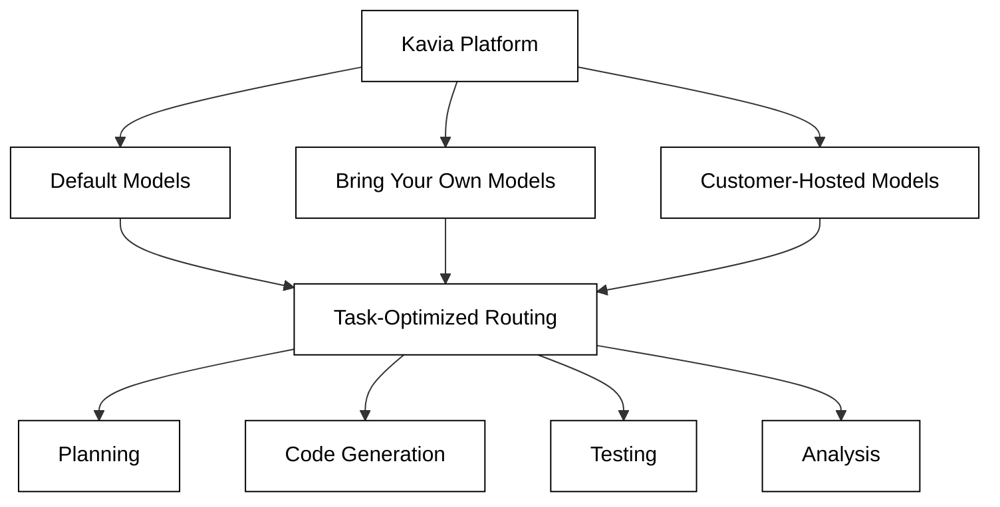
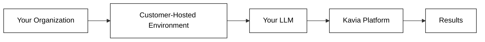

# Model Configuration

Kavia AI provides flexibility in how LLMs are used across the platform. Organizations can use Kavia's default models, bring their own, or run models in customer-hosted environments.

## Default Models Provided by Kavia

Kavia ships with a curated set of enterprise-grade LLMs optimized for different stages of the SDLC. These models are deployed using **Azure** and **AWS Bedrock** infrastructure, ensuring high availability and security. All models are pre-configured and require no setup — they work out of the box for all Kavia features including code generation, test generation, planning, and analysis.

### Supported Models

**OpenAI GPT Models:**
- GPT 5.1
- GPT 5.2
- GPT 5.5
- GPT 5.3 Codex

**Google Models:**
- Gemini-3-Pro

**Anthropic Claude Models:**
- Claude-Sonnet 4.5
- Claude Sonnet 4.6
- Claude Opus 4.6

Kavia's multi-agent orchestrator selects the appropriate model for each task based on complexity, latency requirements, and the nature of the operation.

## Bring Your Own Models (BYOM)

Kavia allows developers and organizations to select LLMs from enterprise providers, including custom models set up by the customer. Supported options include:

- **Commercial LLM providers** — Connect models from providers such as OpenAI, Anthropic, and Google, deployed via Azure and AWS Bedrock.
- **Custom fine-tuned models** — Bring models that have been fine-tuned on your organization's data or domain.

These models can optionally run in the customer's own hosted environment, ensuring that no data leaves the organization's infrastructure.

## Recommendations from Kavia

When selecting models, Kavia recommends:

- **For high-complexity tasks** (architecture generation, multi-file refactoring, deep analysis) — use larger, more capable models that can handle extended context and multi-step reasoning.
- **For routine tasks** (formatting, simple test generation, boilerplate scaffolding) — use smaller, faster models to optimize for speed and cost.
- **For compliance-sensitive environments** — use customer-hosted models to ensure all data processing stays within your organization's boundaries.

Kavia's orchestrator can automatically route tasks to the most appropriate model when multiple models are configured, balancing capability, latency, and cost.
