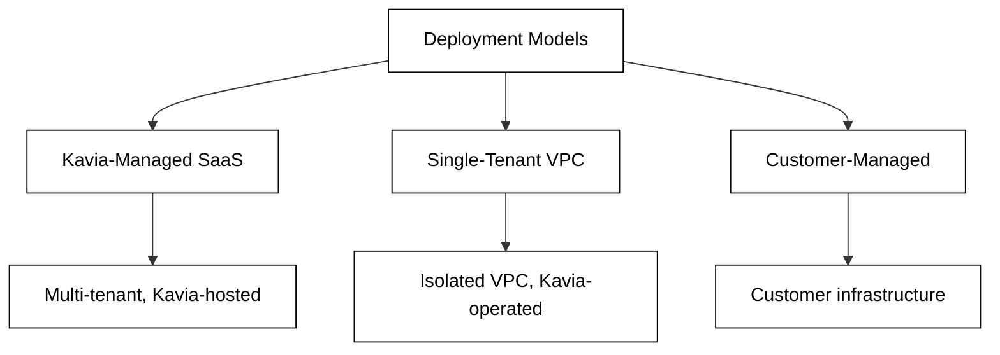
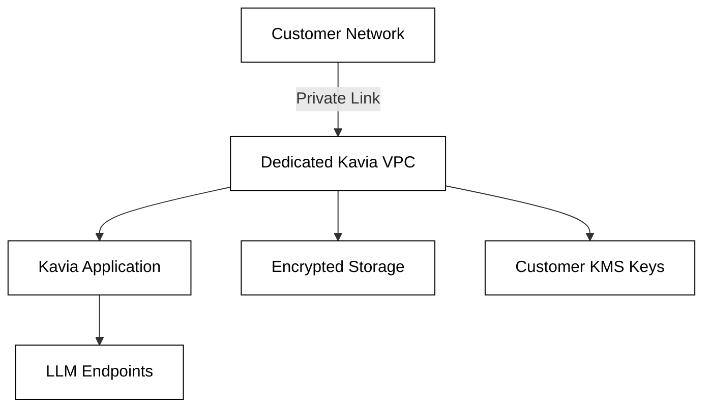

# Secure Deployment

Kavia AI supports multiple deployment models to meet varying enterprise requirements for data residency, isolation, and control.

## Deployment Options

| Deployment Model | Description | Best For |
|---|---|---|
| Kavia-Managed SaaS | Fully hosted by Kavia. Fastest time to value. | Teams evaluating Kavia or with standard security requirements. |
| Single-Tenant VPC | Dedicated VPC operated by Kavia. Fully isolated from other tenants. | Organizations requiring network-level isolation and data residency controls. |
| Customer-Managed | Deployed on the customer's own AWS infrastructure. | Regulated industries or organizations with strict data sovereignty requirements. |

## Single-Tenant VPC Setup

In a single-tenant VPC deployment, Kavia provisions a dedicated environment for your organization. Key characteristics:

- **Network isolation** — Your Kavia instance runs in its own VPC, separate from all other customers.
- **Customer-managed encryption keys** — Bring your own KMS keys so that all data at rest is encrypted with keys you control.
- **IP allow-listing** — Restrict access to the platform to approved IP ranges only.
- **Private endpoints** — No data traverses the public internet.

## Customer-Managed Deployment

For organizations that require full control over their infrastructure, Kavia supports deployment on customer-managed AWS environments. In this model:

- The customer provisions and manages the underlying infrastructure.
- Kavia provides deployment artifacts and configuration guidance.
- LLMs can run entirely within the customer's environment (see [Bring Your Own Models](model.md#bring-your-own-models-byom)).
- All telemetry and logging remain under customer control.

## AWS Deployment Targets

Kavia supports hosting generated applications via:

- **AWS Amplify** — For frontend and full-stack web applications.
- **AWS Fargate** — For containerized backend services and APIs.

These targets are configurable per project from within the Kavia platform.
