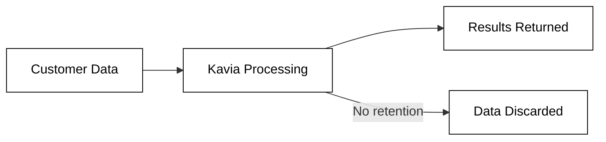
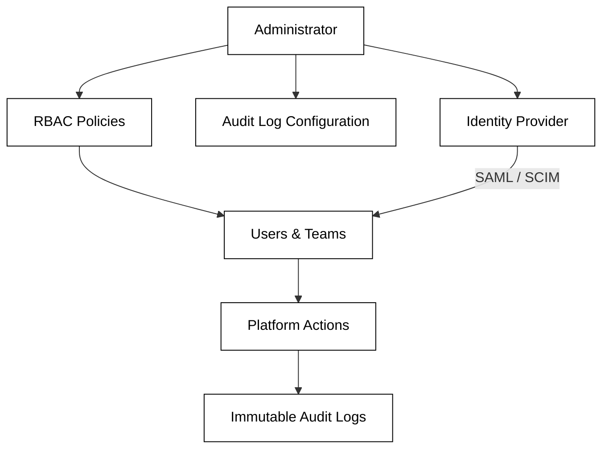

# Security

Kavia AI is built with enterprise security as a foundational requirement, not an afterthought. This page covers how Kavia handles data, what compliance standards it meets, and the controls available to administrators.

## Data Transparency

### Zero Data Retention (ZDR)

Kavia operates on a default Zero Data Retention policy. This means:

- No customer code, documents, or project data is retained by Kavia after processing.
- Telemetry is off by default.
- Kavia explicitly does not train on customer data.

### Secrets Handling

Kavia integrates with vault systems for secret management. Additional protections include:

- **Secret redaction** — Sensitive values are automatically detected and redacted from logs and outputs.
- **Blocked system calls** — Potentially dangerous system calls are blocked at the platform level.
- **Path allow-lists** — File system access is restricted to explicitly permitted paths.

### Audit and Governance

Kavia provides comprehensive audit and governance capabilities for enterprise environments:

| Capability | Description |
|---|---|
| Immutable Audit Logs | All actions within the platform are logged in tamper-proof audit trails. |
| Role-Based Access Control (RBAC) | Define granular roles and permissions for users and teams. |
| SAML / SCIM | Integrate with your identity provider for single sign-on and automated user provisioning. |
| Compliance Logging | Structured logs suitable for compliance review and export. |
| IP Allow-Lists | Restrict platform access to approved network ranges. |

## Compliance

Kavia AI is actively pursuing and maintaining compliance with the following standards:

| Standard | Status |
|---|---|
| SOC 2 Type II | In progress |
| HIPAA | Ready |
| FedRAMP | Documentation prepared |

Audit artifacts are available under NDA for enterprise prospects during evaluation.

### Enterprise Compliance Controls

For organizations with specific compliance requirements, Kavia provides:

- **CI/CD orchestration controls** — Enforce policies at the pipeline level to ensure generated code passes all compliance gates before deployment.
- **Traceability** — Every artifact produced by Kavia (requirements, designs, code, tests) is traceable back to its origin, supporting regulatory audits.
- **Data residency** — Through single-tenant VPC or customer-managed deployments, data can be confined to specific geographic regions.

For deployment options that support these controls, see [Secure Deployment](secure-deployment.md).
