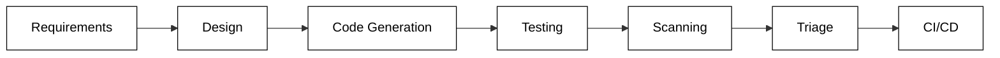
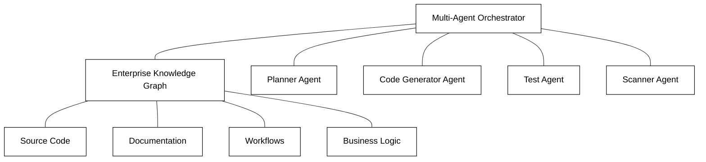
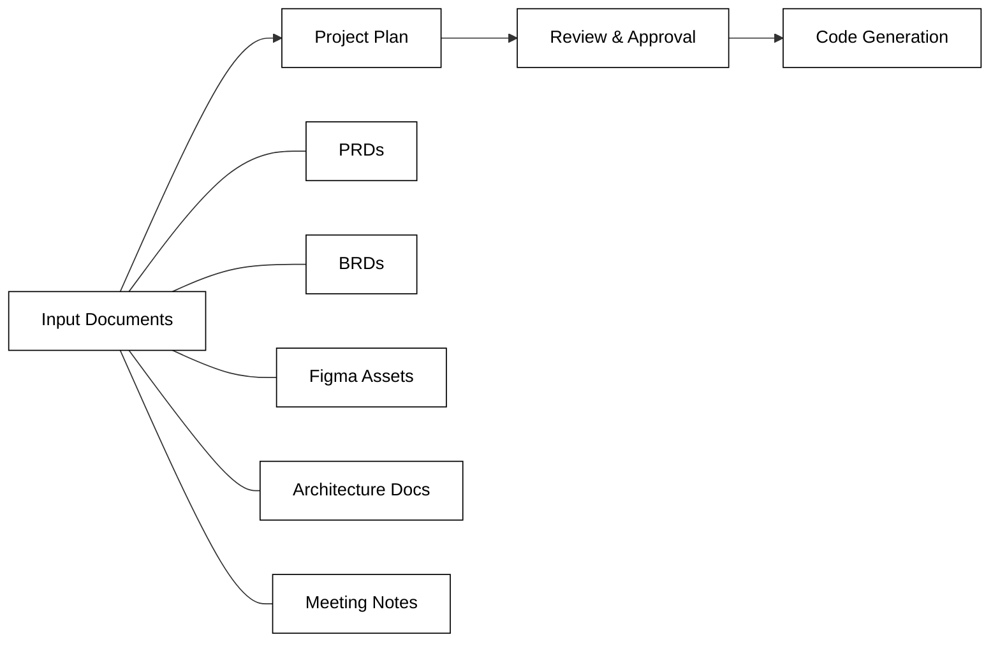

# Overview

## What is Kavia AI

Kavia AI is an enterprise-first, cross-functional workflow platform that spans the full software development lifecycle — from requirements gathering and design through code generation, testing, scanning, and triage.

Unlike IDE-bound coding assistants that focus narrowly on developer productivity, Kavia AI unifies the entire SDLC into an intelligent, agentic workflow. It serves cross-functional teams — product managers, developers, QA engineers, operations, and managers — within a single platform.

## Core Architecture

Kavia AI is powered by two foundational components: the **Enterprise Knowledge Graph** and a **Multi-Agent Orchestrator**.

The Enterprise Knowledge Graph maps relationships between code, documentation, workflows, and business logic. This allows Kavia's multi-agent system to reason across the entire software stack rather than operating on isolated files or snippets.

Source code knowledge graphs are stored inside the repository itself, so each branch carries a version that is accurate with the changes corresponding to that branch. Document knowledge graphs rely on a specialized implementation of agentic retrieval that navigates to the core of a topic efficiently without consuming excessive LLM context.

## Getting Started

Kavia AI is accessible as a web application. To begin:

1. Sign up at the Kavia AI platform.
2. Create or import a project.
3. Connect your repositories, documentation sources, and external tools (GitHub, Jira, Confluence, Bitbucket, CI/CD pipelines).
4. Start working — use Unified Chat, plan generation, or code generation features.

For detailed installation and first-run steps, see the [Quickstart](quickstart.md) guide.

## What You Can Do with Kavia

### Full Project Creation from Prompts or Documents

Kavia can generate a complete project plan — spanning multiple containers and components — from simple prompts or from extensive input documents such as PRDs, BRDs, Figma assets, screenshots, architecture documents, API documents, or meeting notes. Every step in the plan can be auto-generated or interactively refined based on user feedback. Plans can be reviewed and approved by multiple approvers before being handed to Kavia's code generators.

### Unified Chat

Kavia Unified Chat lets you connect all project-related and external assets through a familiar chat interface. You can:

- Ask Kavia to assess complexity for a new user story.
- Analyze a bug in Jira and surface potential root causes.
- Analyze logs from Datadog sessions.
- Extract screens from a Figma file and implement them.
- Generate documents, perform deep analysis, or trigger code generation — all from the same chat.

### Code Generation

Kavia generates production-ready code that adheres to enterprise standards and best practices, even with basic prompting. The platform automatically incorporates proper error handling, security considerations, documentation, testing frameworks, and architectural patterns. It supports scaffolding for 30+ frameworks, and the DevOps agent can scaffold additional frameworks automatically.

### Testing and QA

Kavia's testing agents handle test-case generation, regression automation, and bug triage. These agents work in context with the knowledge graph, understanding not just the code under test but its relationships to requirements, design decisions, and deployment targets.

### Manager Dashboard

Kavia provides usage dashboards that give managers visibility into team activity — which members have adopted Kavia effectively, which features are heavily used or underutilized, and the results being generated from Kavia sessions. This is critical for enterprise AI rollouts where training and adoption directly impact ROI.

### Enterprise Integrations

Kavia integrates with existing enterprise ecosystems including GitHub, Jira, Confluence, Bitbucket, and CI/CD pipelines, fitting into established workflows without requiring teams to change how they work.