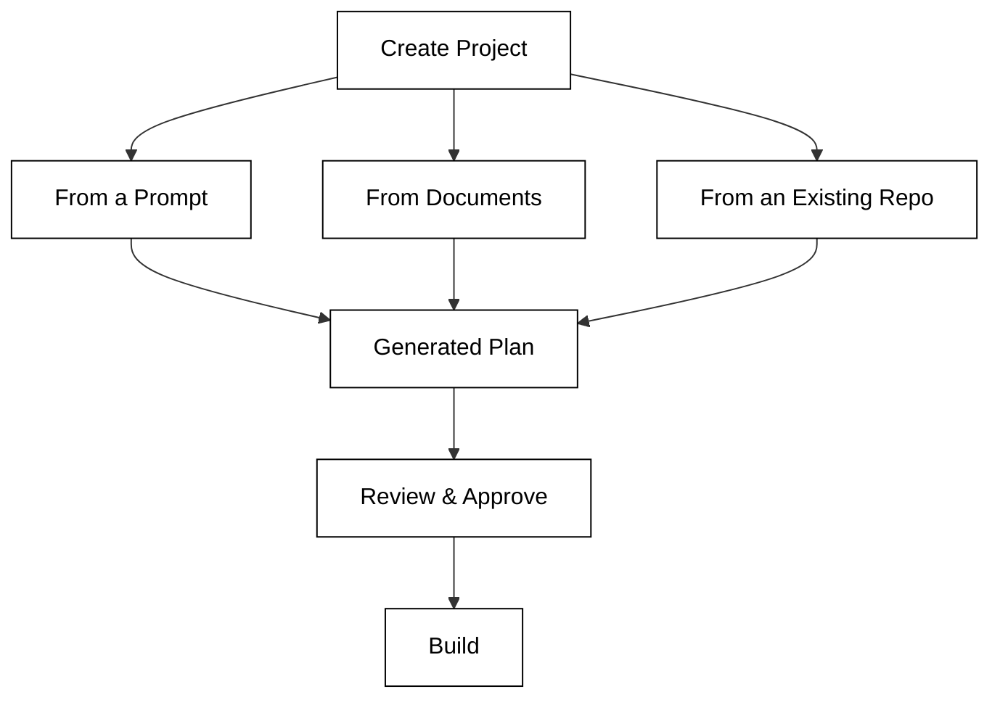

# Quickstart

This guide walks you through setting up Kavia AI and running your first project.

## Prerequisites

- A modern web browser (Chrome, Firefox, Edge, or Safari).
- A Kavia AI account. Sign up at the Kavia AI platform if you do not already have one.
- Access to a source code repository (GitHub, Bitbucket, or GitLab) that you want to connect.

## Step 1 — Sign In

Navigate to the Kavia AI web application and sign in with your credentials. Enterprise users may sign in via SSO (SAML/SCIM) if configured by their organization.

## Step 2 — Create a Project

After signing in, create a new project. You can start a project in one of the following ways:

- **From a Prompt** — Describe what you want to build in plain language. Kavia will generate a project plan with containers, components, and architecture.
- **From Documents** — Upload PRDs, BRDs, Figma assets, screenshots, API docs, or meeting notes. Kavia will analyze them and produce a structured plan.
- **From an Existing Repository** — Connect a repository. Kavia will ingest the codebase and build a knowledge graph for it.

## Step 3 — Connect Your Tools

Connect external tools to enrich Kavia's context and enable end-to-end workflows:

| Tool Category | Examples |
|---|---|
| Source Control | GitHub, Bitbucket, GitLab |
| Project Management | Jira, Confluence |
| Design | Figma |
| CI/CD | Jenkins, GitHub Actions, AWS CodePipeline |
| Observability | Datadog |

## Step 4 — Start Building

Once your project and integrations are configured, you can begin working through any of Kavia's capabilities:

- **Unified Chat** — Ask questions, trigger analysis, or generate code from a single chat interface.
- **Plan Generation** — Let Kavia create or refine project plans interactively.
- **Code Generation** — Generate production-ready code across 30+ frameworks.
- **Testing** — Auto-generate test cases and run regression automation.

## Step 5 — Deploy

Kavia supports hosting of generated applications via AWS Amplify and AWS Fargate. Configure your deployment target from within the project settings.

## Next Steps

- Explore [Model Configuration](../enterprise/model.md) to choose or bring your own LLMs.
- Read about [Security](../enterprise/security.md) and compliance controls for enterprise deployments.
- Learn about [Kavia Subagents](../advanced-concepts/kavia-subagents.md) for deeper understanding of the multi-agent architecture.
